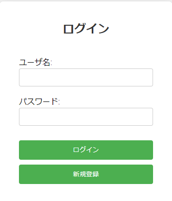
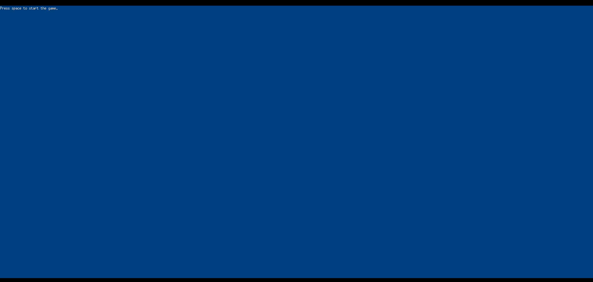
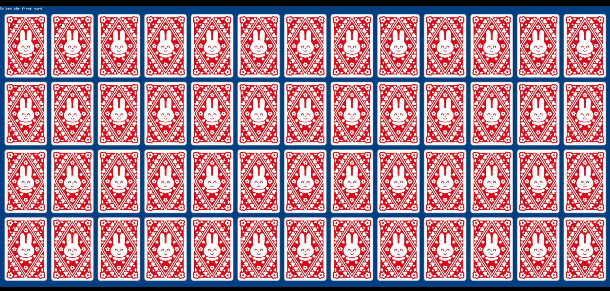

<div id="top"></div>

## 使用技術一覧

<!-- シールド一覧 -->
<!-- 該当するプロジェクトの中から任意のものを選ぶ-->
<p style="display: inline">
  <!-- フロントエンドのフレームワーク一覧 -->
  
  
</p>

## 目次

1. [Concentration](#Concentration)
2. [遊び方](#遊び方)
3. [環境](#環境)
4. [テスト](#テスト)

<!-- プロジェクト名を記載 -->

## Concentration

Web(local) で遊べる神経衰弱

## 遊び方
1. main.go があるディレクトリで以下のコマンドを実行

```go
$ go run .
Server is running at http://localhost:8080
```
2. 上記のようにサーバーが立ち上がったらアクセス。



3. 新規登録をしてからログインする



4. 上記の画面になったら space キーを押してゲーム開始



5. クリックでカードをめくりそろわなかった場合は space キーで裏返す


<p align="right">(<a href="#top">トップへ</a>)</p>

## 環境

<!-- 言語、フレームワーク、ミドルウェア、インフラの一覧とバージョンを記載 -->

| 言語・フレームワーク  | バージョン |
| --------------------- | ---------- |
| GO                    | 1.22.0     |


<p align="right">(<a href="#top">トップへ</a>)</p>

## テスト
handler_test.go はありますが現在開発中であり動きません。

